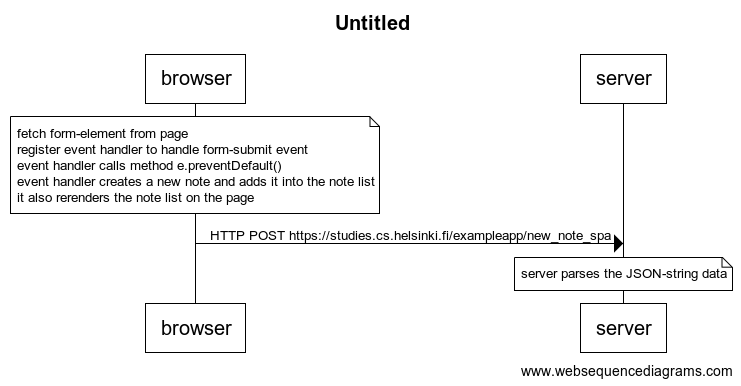

# Diagram depicting the situation where the user creates a new note using the single page version of the app.



```
note over browser: 
fetch form-element from page
register event handler to handle form-submit event
event handler calls method e.preventDefault()
event handler creates a new note and adds it into the note list
it also rerenders the note list on the page
end note

browser->server: HTTP POST https://studies.cs.helsinki.fi/exampleapp/new_note_spa

note over server:
server parses the JSON-string data
end note
```
